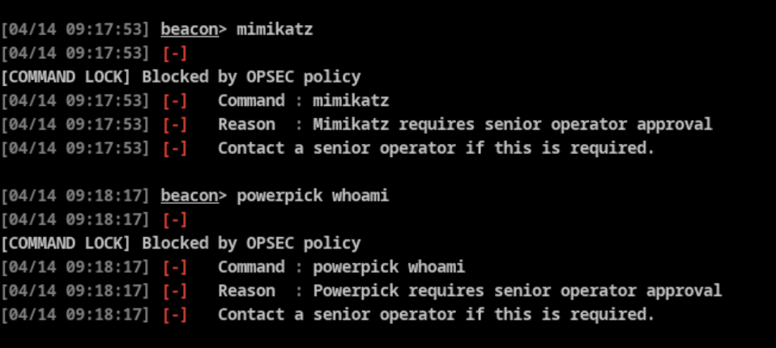

# Cobalt Strike-Command-Lock

A Cobalt Strike Aggressor (CNA) script that implements role-based command blocking for red team operations.

Cobalt Strike has no native operator permission controls or command restrictions — unlike Mythic C2 which has role-based access built-in. This script fills that gap by intercepting beacon commands and checking them against a blocklist before execution.

---

## How It Works

The script uses Aggressor Script `alias` to intercept beacon commands before they execute. When an operator runs a command, the script checks it against a blocklist. If a match is found, the command is blocked and a reason is shown to the operator. Senior operators can manage the blocklist dynamically at runtime.

```
[COMMAND LOCK] Blocked by OPSEC policy
  Command : inject
  Reason  : Process injection requires senior operator approval
  Contact a senior operator if this is required.
```

---

## Files

| File | Description |
|------|-------------|
| `command_lock.cna` | Main Aggressor script — load this in Script Manager |
| `blocklist.txt` | Base blocklist — edit this to define permanent rules |
| `blocklist_runtime.txt` | Runtime rules added via `lock-add` — auto-generated |

---

## Setup

**1. Define your senior operators**

Open `command_lock.cna` and set your team lead nicks:

```
@SENIOR_OPERATORS = @("alice", "john", "teamlead");
```

These must match the Cobalt Strike operator nicks used when connecting to the team server.

**2. Load the script**

In Cobalt Strike: **Script Manager → Load → `command_lock.cna`**

> If you use other BOF CNA files (e.g. `winrm-client.cna`), load those **before** `command_lock.cna`. The last alias registered wins — `command_lock.cna` must always be loaded last.

**3. Verify your role**

```
lock-who
```

---

## Commands

All commands are typed directly in the beacon interactive console.

| Command | Access | Description |
|---------|--------|-------------|
| `lock-list` | Everyone | Show all active block rules |
| `lock-who` | Everyone | Show your role and senior operator list |
| `lock-help` | Everyone | Show command reference |
| `lock-add <type> <pattern> <reason>` | Senior only | Add a block rule |
| `lock-remove <pattern>` | Senior only | Remove a block rule |
| `lock-reload` | Senior only | Reload blocklist from disk |
| `lock-addsenior <nick>` | Senior only | Add a senior operator |
| `lock-removesenior <nick>` | Senior only | Remove a senior operator |

---

## Blocklist Format

Rules are stored in `blocklist.txt` using pipe-delimited format:

```
TYPE|PATTERN|REASON
```

### Types

| Type | Behavior |
|------|----------|
| `command` | Blocks a built-in beacon command entirely — pattern is the exact command name |
| `shell` | Blocks `shell` commands whose args contain the pattern |
| `powershell` | Blocks `powershell` commands whose args contain the pattern |
| `run` | Blocks `run` commands whose args contain the pattern |
| `any` | Blocks across `shell`, `powershell`, and `run` if pattern found in args |

### Examples

```
# Block built-in beacon commands entirely
command|inject|Process injection requires senior operator approval
command|mimikatz|Mimikatz requires senior operator approval
command|hashdump|Hashdump triggers EDR alerts - requires senior operator approval

# Block shell commands containing dangerous patterns
shell|net stop|Stopping services may disrupt target operations
shell|shutdown|Shutting down target will kill beacon

# Block powershell commands containing dangerous patterns
powershell|stop-service|Stopping services may disrupt target operations

# Block pattern across all shell/powershell/run
any|format|Destructive operation - not permitted
```

> Do not use `|` in your reason text — it is used as the delimiter.

---

## Runtime Rule Management

Senior operators can add and remove rules without editing files or reloading the script:

```
# Add a rule
lock-add command logonpasswords Mimikatz logonpasswords - requires approval
lock-add shell whoami OPSEC risk - reveals user context
lock-add any net stop Stopping services may disrupt target

# Remove a rule
lock-remove logonpasswords

# View all active rules
lock-list

# Reload from disk (picks up manual edits to blocklist.txt)
lock-reload
```

Runtime rules are saved to `blocklist_runtime.txt` and persist across CS restarts. Both `blocklist.txt` and `blocklist_runtime.txt` are loaded on startup and merged in memory.

---

## Adding New Commands to Intercept

The blocklist entry alone is not enough for built-in beacon commands — an `alias` must also exist in the CNA to intercept the command. Without the alias, CS executes the command directly and never checks the blocklist.

**Step 1 — Add the alias in `command_lock.cna`:**

```
alias <commandname> {
    local('$reason');
    $reason = is_command_blocked("<commandname>");
    if ($reason !is $null) { block_msg($1, "<commandname>", $reason); return; }
    b<commandname>($1);
}
```

**Step 2 — Add the rule to `blocklist.txt` or via `lock-add`:**

```
lock-add command <commandname> Your reason here
```

**Step 3 — Reload the script in Script Manager.**

### Common built-in commands and their signatures

| Command | Alias passthrough |
|---------|------------------|
| `logonpasswords` | `blogonpasswords($1)` |
| `wdigest` | `bwdigest($1)` |
| `keylogger` | `bkeylogger($1)` |
| `screenshot` | `bscreenshot($1)` |
| `upload` | `bupload($1, $2)` |
| `download` | `bdownload($1, $2)` |
| `make_token` | `bmake_token($1, $2, $3, $4)` |
| `steal_token` | `bsteal_token($1, $2)` |
| `socks` | `bsocks($1, $2)` |
| `chromedump` | `bchromedump($1)` |

---

## Script Load Order

Load order matters. The last `alias` registered in Cobalt Strike wins. Always load `command_lock.cna` **last**:

```
1. winrm-client.cna      ← BOF CNA registers its alias
2. other-bof.cna         ← other BOF CNAs
3. command_lock.cna      ← our aliases override all previous ones
```

If you load a new BOF CNA after `command_lock.cna`, unload and reload `command_lock.cna` to restore interception.

---

## Limitations

| Limitation | Notes |
|------------|-------|
| Operator loads a CNA after `command_lock.cna` | Their alias overrides ours — control who can load scripts via team server access |
| Operator edits `blocklist.txt` on disk | Restrict file system permissions on the team server |
| Commands without an alias | Commands with no alias in the CNA execute freely even if in the blocklist — add aliases for every command you want to enforce |
| BOFs with custom CNA aliases | Require an override alias in `command_lock.cna` or use `on beacon_inline_execute` hook |

---

## Default Blocked Commands

### Built-in Beacon Commands
`inject`, `shinject`, `shspawn`, `spawnas`, `spawnu`, `migrate`, `psinject`, `dcsync`, `hashdump`, `mimikatz`, `jump`, `remote-exec`, `getsystem`, `powerpick`, `logonpasswords`, `execute-assembly`

### Shell Patterns
`net stop`, `sc stop`, `sc delete`, `taskkill /f`, `shutdown`, `format`, `del /f /s /q c:\`, `rd /s /q c:\`, `reg delete hklm`, `bcdedit`, `vssadmin delete`, `whoami`

### PowerShell Patterns
`stop-service`, `stop-process -force`, `remove-item -recurse -force c:\`, `restart-computer`, `stop-computer`

### Run Patterns
`shutdown`, `format`

---

## Requirements

- Cobalt Strike 4.x
- Aggressor Script support (built-in to CS)

